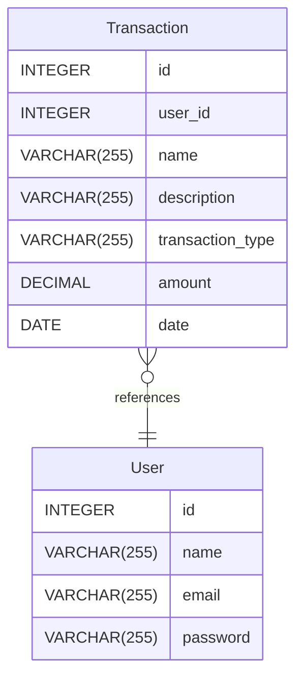

# Untitled diagram documentation
## Summary

- [Introduction](#introduction)
- [Database Type](#database-type)
- [Table Structure](#table-structure)
	- [User](#user)
	- [Transaction](#transaction)
- [Relationships](#relationships)
- [Database Diagram](#database-diagram)

## Introduction

## Database type

- **Database system:** PostgreSQL
## Table structure

### User

| Name         | Type         | Settings                       | References | Note |
| ------------ | ------------ | ------------------------------ | ---------- | ---- |
| **id**       | INTEGER      | 🔑 PK, not null, autoincrement |            |      |
| **name**     | VARCHAR(255) | null                           |            |      |
| **email**    | VARCHAR(255) | null, unique                   |            |      |
| **password** | VARCHAR(255) | null                           |            |      | 

### Transaction

| Name                 | Type         | Settings                       | References                  | Note |
| -------------------- | ------------ | ------------------------------ | --------------------------- | ---- |
| **id**               | INTEGER      | 🔑 PK, not null, autoincrement |                             |      |
| **user_id**          | INTEGER      | null                           | fk_Transaction_user_id_User |      |
| **name**             | VARCHAR(255) | null                           |                             |      |
| **description**      | VARCHAR(255) | null                           |                             |      |
| **transaction_type** | VARCHAR(255) | null                           |                             |      |
| **amount**           | DECIMAL      | null                           |                             |      |
| **date**             | DATE         | null                           |                             |      | 

## Relationships

- **Transaction to User**: many_to_one

## Database Diagram

